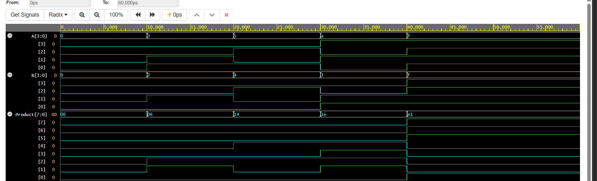

# Binary-Multiplier-Design# CODETECH_TASK3

### Project Overview

This project implements a 4-Bit Binary Multiplier using Verilog HDL. The multiplier performs binary multiplication between two 4-bit input numbers and produces an 8-bit product as the output. Binary multipliers are essential arithmetic circuits used in digital systems, processors, and VLSI design. The design was simulated and verified using EDA Playground and EPWave.

---

## Objectives

- Design a 4-Bit Binary Multiplier using Verilog HDL.
- Perform binary multiplication of two 4-bit input numbers.
- Verify the functionality through simulation and waveform analysis.
- Understand arithmetic circuit design used in digital systems and VLSI.

---

## Tools Used

- Verilog HDL
- EDA Playground
- EPWave
- GitHub

---

## Project Files

- `design.v.txt` – Verilog module implementing the 4-Bit Binary Multiplier.
- `testbench.v.txt` – Testbench for verifying different multiplication operations.
- `Waveform.png` – Simulation waveform of the Binary Multiplier.

---

## Test Cases

| A (4-bit) | B (4-bit) | Product (8-bit) |
|-----------|-----------|-----------------|
| 0000 | 0000 | 00000000 |
| 0011 | 0010 | 00000110 |
| 0101 | 0100 | 00010100 |
| 1010 | 0011 | 00011110 |
| 1111 | 1111 | 11100001 |

---

## Simulation Results

The simulation successfully verified the functionality of the 4-Bit Binary Multiplier. Different combinations of 4-bit inputs were applied, and the generated 8-bit product matched the expected binary multiplication results. The waveform generated in EPWave confirmed the correct multiplication operation for all test cases.

---

## Waveform

### Binary Multiplier Waveform

---

## Conclusion

This project demonstrates the design and simulation of a 4-Bit Binary Multiplier using Verilog HDL. The multiplier was successfully implemented and verified through simulation using EDA Playground and waveform analysis using EPWave. The project provides practical knowledge of binary multiplication, arithmetic circuit implementation, and Verilog-based digital design, strengthening the understanding of fundamental VLSI concepts.
